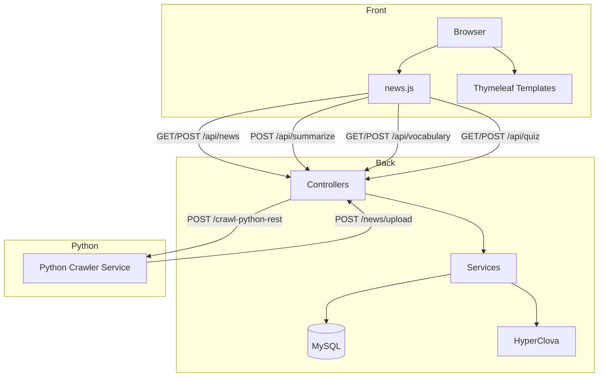

Finance News — 중간발표 자료 초안

### 문서 정보
- **버전**: v0.1 (초안)
- **작성일**: ${TODAY}
- **대상**: 지도교수님 중간점검 발표

### 1) 프로젝트 개요
- **목표**: 금융 뉴스 소비를 돕기 위해, 뉴스 요약, 금융용어 학습, 개인화 퀴즈/관심 뉴스 추천을 제공하는 웹 서비스
- **핵심 기능**: 뉴스 수집·저장·조회, 키워드 추출/클라우드, AI 요약(일반/맞춤형), 용어장(문맥 문장 포함), 퀴즈(단답/십자말), 관심 뉴스(클릭 이벤트 기반), 키워드 빈도/트렌드
- **기술스택**: Spring Boot, Spring MVC, Spring Data JPA, Thymeleaf, MySQL, JavaScript(ES6), Swagger(OpenAPI), 외부 요약 API(Clova)

### 2) 시스템 구성
- **프런트엔드**: `Thymeleaf` 템플릿 + 정적 리소스(`static/js/news.js`, `ai.js`, `term.js`) 기반 UI
- **백엔드**: Spring MVC Controller → Service → Repository → MySQL
- **외부연동**: HyperClova 요약 API, Python 크롤러 REST 연동

### 3) 구현 현황 요약 (핵심 흐름)
- **뉴스 목록/페이지네이션**: `/api/news?page&size`, 프런트 `news.js`의 `loadTodayNews()`로 카드 렌더링 및 페이지네이션
- **관심 뉴스(개인화)**: `/api/news/interest` — 세션 사용자별 클릭 수 기준 상위 N개
- **뉴스 상세 모달**: 제목 클릭 시 상세조회(`/api/news/{id}`), 본문 내 금융 용어 하이라이트, 키워드 태그 표시(`/api/news/{id}/keywords`), 원문 이동
- **AI 요약(일반/맞춤형)**: `/api/summarize`(일반), `/api/summarize/chat`(chat 기반). 모달의 AI 버튼으로 요청
- **키워드 기반 탐색**: 키워드 태그 클릭 → `/api/news?keyword=...` 결과 모달 노출
- **용어장**: 추가(`/api/vocabulary/add`), 조회(`/api/vocabulary/list`), 상세(`/api/vocabulary/{id}`), 삭제 및 즐겨찾기 토글(`/api/vocabulary/star/{id}`)
  - 문맥 문장 추출: `SentenceExtractor`로 뉴스 본문에서 해당 용어 포함 문장 추출 저장
- **퀴즈**: 단답(`/api/quiz/short-answer`), 십자말(`/api/quiz/crossword`), 제출(`/api/quiz/submit`)
- **이벤트 수집**: `/events/batch` — 기사 보기(view) 등 사용자 상호작용을 배치로 수집
- **키워드 빈도/클라우드**: `/keyword-cloud` 뷰, 관련 API는 `KeywordFrequencyController`

### 4) API 요약 (주요 엔드포인트)
- **뉴스**
  - POST `/api/news` — 뉴스 등록
  - GET `/api/news` — 뉴스 페이지 조회(page,size)
  - GET `/api/news/{id}` — 뉴스 상세(용어 하이라이트 포함)
  - GET `/api/news/{id}/keywords` — 뉴스별 키워드 상위 목록
  - GET `/api/news?keyword=...` — 키워드로 뉴스 목록 (페이징)
  - GET `/api/news/interest` — 사용자 관심 뉴스 상위 N
  - POST `/news/upload` — 파이썬 크롤러 업로드 수신(키워드/용어 포함 저장)
  - POST `/crawl-python-rest` — 파이썬 REST 크롤링 트리거
- **요약**
  - POST `/api/summarize` — 일반 요약
  - POST `/api/summarize/chat` — 맞춤형(chat) 요약
- **용어장** (`/api/vocabulary`)
  - POST `/add` — 단어 추가(뉴스 문맥 문장 포함)
  - GET `/list` — 내 단어 목록(검색/정렬)
  - GET `/{id}` — 단어 상세
  - DELETE `/{id}` — 삭제
  - POST `/star/{id}` — 즐겨찾기 토글
- **퀴즈** (`/api/quiz`)
  - GET `/short-answer`, GET `/crossword`, POST `/submit`
- **키워드빈도**: `/api/keyword-frequency/*` (빈도/트렌드 관련)
- **이벤트**: `/events/batch` — 사용자 이벤트 수집

Swagger UI는 `application.properties`에서 활성화되어 있음
- `springdoc.swagger-ui.path=/swagger-ui.html`
- `springdoc.packages-to-scan=Project.Finance_News`

### 5) 데이터 모델 (주요 엔티티)
- `User`, `News`, `NewsKeyword`, `NewsSummary`
- `Term`, `Glossary`, `UserVocabulary`
- `Quiz`, `QuizTerm`, `QuizResult`
- `KeywordFrequency`, `KeywordTrend`
- `UserPoint`, `UserBadge`, `UserNewsLog`

관계: 사용자-뉴스(로그/관심), 뉴스-키워드(N:1), 사용자-용어장(N:M), 퀴즈-결과(1:N)

### 6) UI/화면 구성 (주요 템플릿)
- `home.html`: 홈
- `login/loginForm.html`, `loginHome.html`: 로그인/로그인 홈
- `vocabulary.html`: 단어장
- `quiz/quiz.html`, `quiz/crossword.html`: 퀴즈 화면
- `keywordCloud.html`: 키워드 클라우드

발표본에는 핵심 흐름의 스크린샷(목록 → 상세 모달 → 요약 → 키워드 탐색 → 용어장 추가 → 퀴즈)을 포함 권장

### 7) 데모 시나리오 (발표용)
1. 로그인 → Finance 탭 뉴스 로드(페이지네이션 동작)
2. 뉴스 제목 클릭 → 상세 모달/키워드 태그 확인 → 원문 이동
3. AI 요약 버튼(일반/맞춤형) → 응답 표시
4. 키워드 태그 클릭 → 해당 키워드 관련 뉴스 목록 모달
5. 용어 하이라이트 클릭 → 용어 팝업 → 단어장 추가
6. 단어장 페이지에서 목록/즐겨찾기 확인
7. 퀴즈 페이지(단답/십자말) 문제 생성 및 제출

### 8) 품질/운영 고려사항
- 로깅/문제분석: JPA SQL 출력, 문제 리포트(Gradle reports), Swagger 문서화
- 보안: 외부 API 키는 서버 환경변수/Secret으로 관리(발표 자료에는 마스킹)
- 성능: 크롤링/요약 비동기 처리 고려, 인덱스/캐시 설계 예정

### 9) 향후 계획(Backlog)
- 추천 고도화(이벤트 기반 개인화 랭킹 개선)
- 요약 품질 개선 및 사용자 설정 반영 강화
- 크롤러 안정화(중복/에러 처리), 기사 이미지 품질 향상
- ERD 정교화 및 마이그레이션 정책 수립
- E2E 테스트/부하 테스트 추가

### 10) 로컬 실행/문서 보기
- 애플리케이션 실행: `./gradlew bootRun`
- Swagger 문서: `/swagger-ui.html`

### 11) PDF로 내보내기
- 방법 A) Node 기반
  1) `npm i -g md-to-pdf`
  2) `md-to-pdf docs/interim_report.md`
  3) `docs/interim_report.pdf` 생성
- 방법 B) 브라우저 인쇄
  1) Markdown 뷰어(IDE 확장 등)에서 HTML로 열기
  2) 브라우저 인쇄 → PDF 저장(머리글/바닥글 제거, 여백 10~15mm 권장)

부록 A) 발표 슬라이드 구성 팁
- 문제정의 → 목표/가치 → 아키텍처 → 데모 → 정량지표(있으면) → 한계/개선계획 → Q&A

